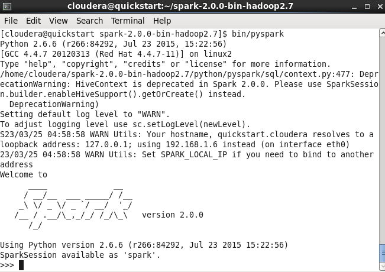
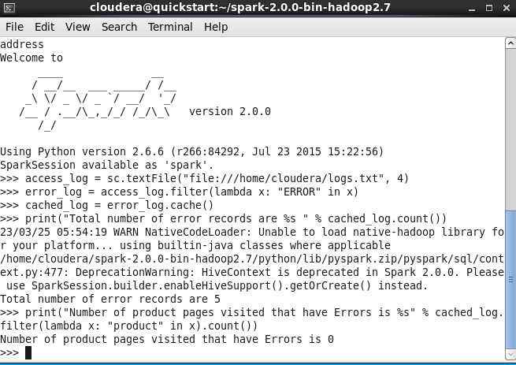
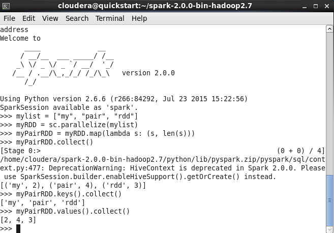
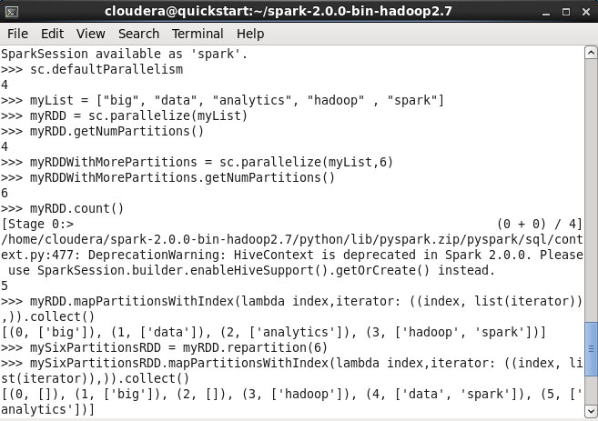
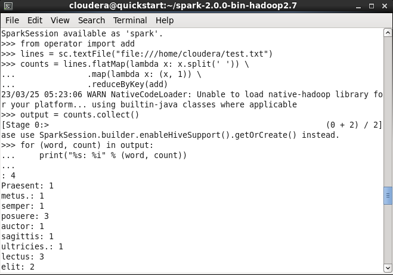
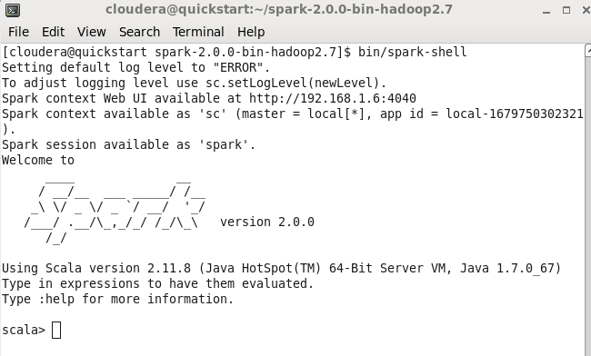
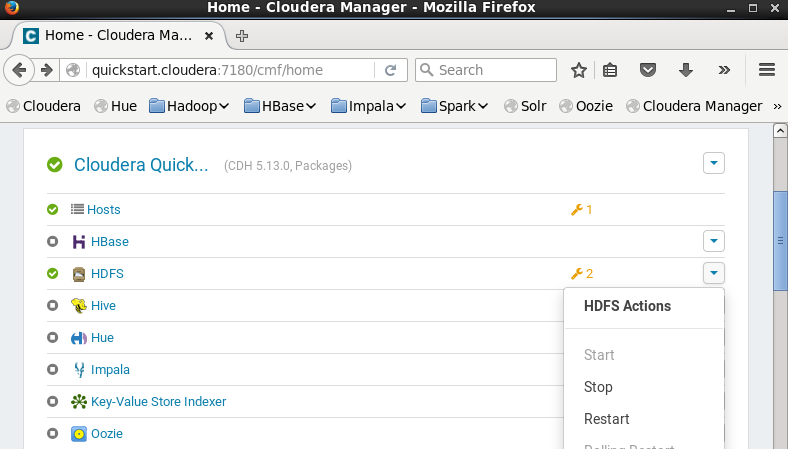
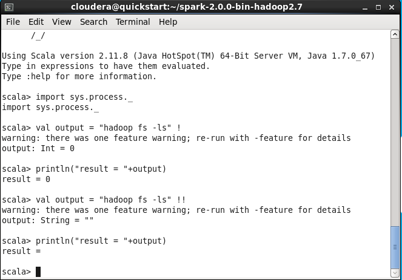
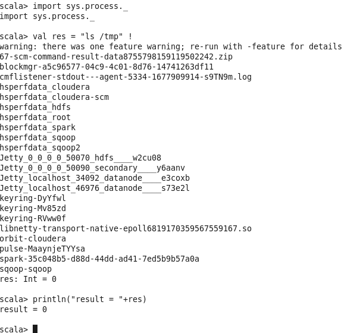

# Experiment Code Chapter 3

Nama : Yudas Malabi

Kelas : TI 3C / 20

NIM : 2041720054

## Langkah-langkah pengerjaan

### Uji Coba PySpark

Menjalankan service dari pyspark terlebih dahulu dengan perintah 

<code>cd spark-2.0.0-bin-hadoop2.7</code>

<code>bin/pyspark</code>

1. Uji coba <code>Accumulator.py</code>

Hasil : Berhasil. Fungsi accumulator (bertujuan akumulasi shared variable) berhasil dijalankan dengan output "4950".

2. Uji coba <code>BroadCast.py</code>

Hasil : Berhasil. Fungsi Broadcast (Membuat variabel broadcast) sesuai range dan untuk mengakses nilai matriks / array menggunakan atribut broadcastVar.value

3. Uji coba <code>LogAnalytics.py</code>

Hasil : Berhasil. Fungsi filter untuk memfilter kata "Error" dan "product" pada log file. dan Count untuk menghitung jumlahnya.

4. Uji coba <code>PairRDD.py</code>

Hasil : Berhasil. fungsi dasar dari sebuah collection. 
- method maps digunakan untuk mapping sebuah collection 
    - key: variabel myList
    - value: jumlah huruf dari tiap" kata variabel myList
- myPairRDD.collect(): print collection
- myPairRDD.keys().collect(): print key pada collection
- myPairRDD.values().collect(): print values pada collection

5. Uji coba <code>UnderstandingRDD.py</code>

Hasil : Berhasil. Membuat sebuah list, dengan mempraktikan yaitu menghitung jumlah partisi, elemen, menampilkan data pada collection, dan memodifikasi collection (menambahkan atau mengurangi).

6. Uji coba <code>WordCount.py</code>

Hasil : Berhasil. Menghitung jumlah kata yang ada suatu file (test.txt).

### Uji Coba Scala

Menjalankan service dari sparkshell terlebih dahulu dengan perintah 

<code>cd spark-2.0.0-bin-hadoop2.7</code>

<code>bin/spark-shell</code>

Jalankan juga service cloudera manager dengan perintah:

<code>sudo /home/cloudera/cloudera-manager --express --force</code>

kemudian login pada browser. Setelah itu, jalankan service HDFS

1. Uji coba <code>SystemCommandsOutput.scala</code>

Hasil : Berhasil. Menampilkan list file pada hdfs. Output 0 atau string "" karna belum terdapat file.

2. Uji coba <code>SystemCommandsReturnCode.scala</code>

Hasil : Berhasil. Menampilkan list file pada folder /tmp (temporary file)

# Tugas Praktikum 2

1. Kode 1
    * sc : instansiasi dari spark context
    * accumulator : bertujuan akumulasi shared variable
    * parallelize : method pada spark context yang digunakan untuk membuat RDD (Collection).
    * lambda : melakukan transformasi data pada RDD
    * value : kumpulan data yang dapat dibagi menjadi beberapa bagian (partisi) dan didistribusikan ke beberapa node dalam sebuah cluster.

2. Kode 2
    * broadcast : mengoptimalkan pengiriman data ke worker node dalam sebuah cluster sesuai range.
    * list : menyimpan dan memproses kumpulan data yang terdistribusi di beberapa node (dalam bentuk array)
    * range : menghitung collection pada rentang bilangan tertentu.

3. Kode 3
    * textFile : membaca file teks pada Spark dan mengubahnya menjadi RDD
    * filter : memfilter elemen-elemen RDD berdasarkan kondisi yang diberikan.
    * cache : menyimpan RDD dalam memori pada node-node dalam sebuah cluster.
    * count : menghitung jumlah elemen dalam RDD.

4. Kode 4
    * map : melakukan looping pada collection / RDD
    * collect : berisi elemen dengan tipe data dinamis dalam bentuk list
    * len : menghitung nilai dari suatu variabel
    * keys : kunci / keys dalam sebuah collection / RDD seperti konsep array
    * values : nilai dalam sebuah collection / RDD seperti konsep array

5. Kode 5
    * defaultParallelism : menentukan jumlah partisi default yang akan dibuat ketika membuat RDD
    * getNumPartitions : untuk mendapatkan jumlah partisi dari RDD
    * mapPartitionsWithIndex : untuk melakukan pemrosesan looping pada setiap partisi dari RDD
    * repartition: memindahkan data dari satu partisi ke partisi lainnya secara acak
    * coalesce: untuk mengurangi jumlah partisi dari RDD 
    * toDebugString : untuk menampilkan informasi detail tentang RDD

6. Kode 6
    * flatMap : memproses looping setiap elemen pada RDD dan menghasilkan output dalam bentuk koleksi yang dapat berbeda-beda, termasuk dalam bentuk array, list, atau tuple.
    * reduceByKey : untuk menghitung jumlah pada kunci / keys tertentu pada RDD.
    * split : memecah sebuah string menjadi beberapa bagian berdasarkan sebuah pemisah (delimiter) tertentu.
